# Light GUIStyles

| GUIStyle name | With Text | Without Text |
| --- | --- | --- |
| <h3>AboutWIndowLicenseLabel</h3> | 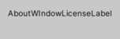 |  |
| <h3>AC BoldHeader</h3> |  |  |
| <h3>AC Button</h3> |  |  |
| <h3>AC ComponentButton</h3> |  |  |
| <h3>AC GroupButton</h3> |  |  |
| <h3>AC LeftArrow</h3> |  |  |
| <h3>AC PreviewHeader</h3> |  |  |
| <h3>AC PreviewText</h3> |  |  |
| <h3>AC RightArrow</h3> |  |  |
| <h3>AM ChannelStripHeaderStyle</h3> |  |  |
| <h3>AM EffectName</h3> |  |  |
| <h3>AM HeaderStyle</h3> |  |  |
| <h3>AM MixerHeader2</h3> |  |  |
| <h3>AM MixerHeader</h3> |  |  |
| <h3>AM ToolbarLabel</h3> |  |  |
| <h3>AM ToolbarObjectField</h3> |  |  |
| <h3>AM TotalVuLabel</h3> |  |  |
| <h3>AM VuValue</h3> |  |  |
| <h3>AnimationEventBackground</h3> | 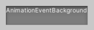 | 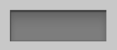 |
| <h3>AnimationEventTooltipArrow</h3> |  |  |
| <h3>AnimationEventTooltip</h3> |  |  |
| <h3>AnimationKeyframeBackground</h3> | 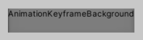 |  |
| <h3>AnimationPlayHead</h3> |  |  |
| <h3>AnimationRowEven</h3> |  |  |
| <h3>AnimationRowOdd</h3> |  |  |
| <h3>AnimationSelectionTextField</h3> | 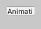 | 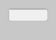 |
| <h3>AnimationTimelineTick</h3> |  |  |
| <h3>AnimClipToolbarButton</h3> | 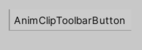 |  |
| <h3>AnimClipToolbarPopup</h3> | 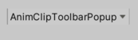 |  |
| <h3>AnimClipToolbar</h3> | 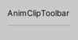 |  |
| <h3>AnimItemBackground</h3> | 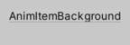 |  |
| <h3>AnimLeftPaneSeparator</h3> | 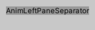 |  |
| <h3>AnimPlayToolbar</h3> | 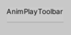 |  |
| <h3>AnimPropDropdown</h3> | 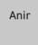 |  |
| <h3>AppCommandLeftOn</h3> |  |  |
| <h3>AppCommandLeft</h3> |  |  |
| <h3>AppCommandMid</h3> |  |  |
| <h3>AppCommandRight</h3> |  |  |
| <h3>AppCommand</h3> |  |  |
| <h3>AppToolbarButtonLeft</h3> | 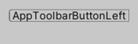 | 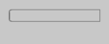 |
| <h3>AppToolbarButtonMid</h3> | 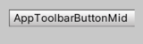 |  |
| <h3>AppToolbarButtonRight</h3> | 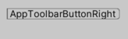 |  |
| <h3>AppToolbar</h3> | 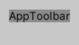 |  |
| <h3>ArrowNavigationLeft</h3> |  |  |
| <h3>ArrowNavigationRight</h3> | 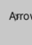 |  |
| <h3>AssetLabel Icon</h3> |  |  |
| <h3>AssetLabel Partial</h3> |  |  |
| <h3>AssetLabel</h3> | 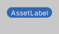 |  |
| <h3>AvatarMappingBox</h3> | 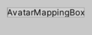 | 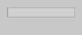 |
| <h3>AvatarMappingErrorLabel</h3> | 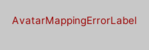 |  |
| <h3>AxisLabelNumberField</h3> |  | 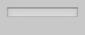 |
| <h3>Badge</h3> |  |  |
| <h3>BoldLabel</h3> | 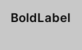 |  |
| <h3>BoldTextField</h3> | 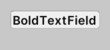 |  |
| <h3>BoldToggle</h3> | 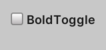 |  |
| <h3>BottomShadowInwards</h3> | 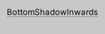 |  |
| <h3>BreadcrumbsSeparator</h3> | 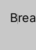 |  |
| <h3>ButtonLeft</h3> | 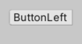 |  |
| <h3>ButtonMid</h3> | 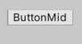 | 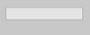 |
| <h3>ButtonRight</h3> | 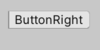 |  |
| <h3>BypassToggle</h3> | 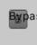 |  |
| <h3>CacheFolderLocation</h3> | 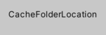 |  |
| <h3>CenteredLabel</h3> | 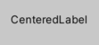 |  |
| <h3>ChannelStripAttenuationBar</h3> |  |  |
| <h3>ChannelStripAttenuationMarkerSquare</h3> |  |  |
| <h3>ChannelStripBg</h3> | 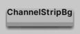 |  |
| <h3>ChannelStripDuckingMarker</h3> |  |  |
| <h3>ChannelStripEffectBar</h3> | 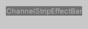 |  |
| <h3>ChannelStripSendReturnBar</h3> | 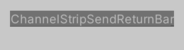 |  |
| <h3>ChannelStripVUMeterBg</h3> |  | 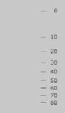 |
| <h3>CircularToggle</h3> |  |  |
| <h3>CN Box</h3> |  |  |
| <h3>CN CenteredText</h3> |  |  |
| <h3>CN CountBadge</h3> |  |  |
| <h3>CN EntryBackEven</h3> |  |  |
| <h3>CN EntryBackOdd</h3> |  |  |
| <h3>CN EntryErrorIconSmall</h3> |  |  |
| <h3>CN EntryErrorIcon</h3> |  |  |
| <h3>CN EntryErrorSmall</h3> |  |  |
| <h3>CN EntryError</h3> |  |  |
| <h3>CN EntryInfoIconSmall</h3> |  |  |
| <h3>CN EntryInfoIcon</h3> |  |  |
| <h3>CN EntryInfoSmall</h3> |  |  |
| <h3>CN EntryInfo</h3> |  |  |
| <h3>CN EntryWarnIconSmall</h3> |  |  |
| <h3>CN EntryWarnIcon</h3> |  |  |
| <h3>CN EntryWarnSmall</h3> |  |  |
| <h3>CN EntryWarn</h3> |  |  |
| <h3>CN Message</h3> |  |  |
| <h3>CN StacktraceBackground</h3> |  |  |
| <h3>CN StacktraceStyle</h3> |  |  |
| <h3>CN StatusError</h3> |  |  |
| <h3>CN StatusInfo</h3> |  |  |
| <h3>CN StatusWarn</h3> |  |  |
| <h3>ColorField</h3> | 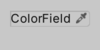 |  |
| <h3>ColorPicker2DThumb</h3> |  |  |
| <h3>ColorPickerBackground</h3> |  |  |
| <h3>ColorPickerBox</h3> | 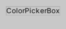 |  |
| <h3>ColorPickerCurrentColor</h3> | 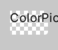 |  |
| <h3>ColorPickerCurrentExposureSwatchBorder</h3> | 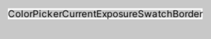 |  |
| <h3>ColorPickerExposureSwatch</h3> |  |  |
| <h3>ColorPickerHorizThumb</h3> |  |  |
| <h3>ColorPickerHueRing HDR</h3> |  |  |
| <h3>ColorPickerHueRingThumb</h3> |  |  |
| <h3>ColorPickerHueRing</h3> | 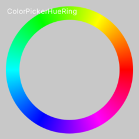 | 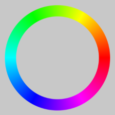 |
| <h3>ColorPickerOriginalColor</h3> | 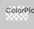 |  |
| <h3>ColorPickerSliderBackground</h3> | 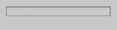 | 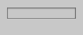 |
| <h3>CommandLeft</h3> |  |  |
| <h3>CommandMid</h3> |  |  |
| <h3>CommandRight</h3> |  |  |
| <h3>Command</h3> |  |  |
| <h3>ContentToolbar</h3> | 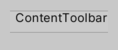 |  |
| <h3>ControlHighlight</h3> |  |  |
| <h3>ControlLabel</h3> |  |  |
| <h3>CurveEditorBackground</h3> |  |  |
| <h3>CurveEditorLabelTickmarksOverflow</h3> |  |  |
| <h3>CurveEditorLabelTickmarks</h3> |  |  |
| <h3>CurveEditorRightAlignedLabel</h3> |  |  |
| <h3>DD Background</h3> |  |  |
| <h3>DD HeaderStyle</h3> |  |  |
| <h3>DD ItemCheckmark</h3> |  |  |
| <h3>DD ItemStyle</h3> |  |  |
| <h3>DD LargeItemStyle</h3> |  |  |
| <h3>DefaultCenteredLargeText</h3> |  |  |
| <h3>DefaultCenteredText</h3> |  |  |
| <h3>DefaultLineSeparator</h3> |  |  |
| <h3>dockareaOverlay</h3> |  |  |
| <h3>dockareaStandalone</h3> |  |  |
| <h3>dockarea</h3> |  |  |
| <h3>dockHeader</h3> |  |  |
| <h3>DopesheetBackground</h3> |  |  |
| <h3>Dopesheetkeyframe</h3> |  |  |
| <h3>DopesheetRippleLeft</h3> |  |  |
| <h3>DopesheetRippleRight</h3> |  |  |
| <h3>DopesheetScaleLeft</h3> |  |  |
| <h3>DopesheetScaleRight</h3> |  |  |
| <h3>dragtab first</h3> |  |  |
| <h3>dragtab scroller next</h3> |  |  |
| <h3>dragtab scroller prev</h3> |  |  |
| <h3>dragtabdropwindow</h3> |  |  |
| <h3>dragtab</h3> |  |  |
| <h3>DropDownButton</h3> |  |  |
| <h3>DropDownToggleButton</h3> |  |  |
| <h3>DropDown</h3> |  |  |
| <h3>DropzoneStyle</h3> |  |  |
| <h3>EditModeSingleButton</h3> |  |  |
| <h3>ErrorLabel</h3> |  |  |
| <h3>ExposablePopupItem</h3> |  |  |
| <h3>ExposablePopupMenu</h3> |  |  |
| <h3>EyeDropperHorizontalLine</h3> |  |  |
| <h3>EyeDropperPickedPixel</h3> |  |  |
| <h3>EyeDropperVerticalLine</h3> |  |  |
| <h3>FloatFieldLinkButton</h3> |  |  |
| <h3>flow background</h3> |  |  |
| <h3>flow node 0 on</h3> |  |  |
| <h3>flow node 0</h3> |  |  |
| <h3>flow node 1 on</h3> |  |  |
| <h3>flow node 1</h3> |  |  |
| <h3>flow node 2 on</h3> |  |  |
| <h3>flow node 2</h3> |  |  |
| <h3>flow node 3 on</h3> |  |  |
| <h3>flow node 3</h3> |  |  |
| <h3>flow node 4 on</h3> |  |  |
| <h3>flow node 4</h3> |  |  |
| <h3>flow node 5 on</h3> |  |  |
| <h3>flow node 5</h3> |  |  |
| <h3>flow node 6 on</h3> |  |  |
| <h3>flow node 6</h3> |  |  |
| <h3>flow node base</h3> |  |  |
| <h3>flow node hex 0 on</h3> |  |  |
| <h3>flow node hex 0</h3> |  |  |
| <h3>flow node hex 1 on</h3> |  |  |
| <h3>flow node hex 1</h3> |  |  |
| <h3>flow node hex 2 on</h3> |  |  |
| <h3>flow node hex 2</h3> |  |  |
| <h3>flow node hex 3 on</h3> |  |  |
| <h3>flow node hex 3</h3> |  |  |
| <h3>flow node hex 4 on</h3> |  |  |
| <h3>flow node hex 4</h3> |  |  |
| <h3>flow node hex 5 on</h3> |  |  |
| <h3>flow node hex 5</h3> |  |  |
| <h3>flow node hex 6 on</h3> |  |  |
| <h3>flow node hex 6</h3> |  |  |
| <h3>flow node hex base</h3> |  |  |
| <h3>flow node titlebar</h3> |  |  |
| <h3>flow target in</h3> |  |  |
| <h3>flow triggerPin in</h3> |  |  |
| <h3>flow triggerPin out</h3> |  |  |
| <h3>flow varPin in</h3> |  |  |
| <h3>flow varPin out</h3> |  |  |
| <h3>flow varPin tooltip</h3> |  |  |
| <h3>FoldoutHeaderIcon</h3> |  |  |
| <h3>FoldoutHeader</h3> |  |  |
| <h3>FoldOutPreDrop</h3> |  |  |
| <h3>Foldout</h3> |  |  |
| <h3>FrameBox</h3> |  |  |
| <h3>Frame</h3> |  |  |
| <h3>GameViewBackground</h3> |  |  |
| <h3>Grad Down Swatch Overlay</h3> |  |  |
| <h3>Grad Down Swatch</h3> |  |  |
| <h3>Grad Up Swatch Overlay</h3> |  |  |
| <h3>Grad Up Swatch</h3> |  |  |
| <h3>grey_border</h3> |  |  |
| <h3>GridListText</h3> |  |  |
| <h3>GridList</h3> |  |  |
| <h3>GroupBox</h3> |  |  |
| <h3>GUIEditor.BreadcrumbLeftBackground</h3> |  |  |
| <h3>GUIEditor.BreadcrumbLeft</h3> |  |  |
| <h3>GUIEditor.BreadcrumbMidBackground</h3> |  |  |
| <h3>GUIEditor.BreadcrumbMid</h3> |  |  |
| <h3>GV Gizmo DropDown</h3> |  |  |
| <h3>HeaderButton</h3> |  |  |
| <h3>HeaderLabel</h3> |  |  |
| <h3>HelpBox</h3> |  |  |
| <h3>Hi Label</h3> |  |  |
| <h3>HorizontalMinMaxScrollbarThumb</h3> |  |  |
| <h3>HorizontalSliderThumbExtent</h3> |  |  |
| <h3>hostview</h3> |  |  |
| <h3>HoverHighlight</h3> |  |  |
| <h3>IconButton</h3> |  |  |
| <h3>IN BigTitle Inner</h3> |  |  |
| <h3>IN BigTitle Post</h3> |  |  |
| <h3>IN BigTitle</h3> |  |  |
| <h3>IN CenteredLabel</h3> |  |  |
| <h3>IN DropDown</h3> |  |  |
| <h3>IN EditColliderButton</h3> |  |  |
| <h3>IN Foldout</h3> |  |  |
| <h3>IN Footer</h3> |  |  |
| <h3>IN Label</h3> |  |  |
| <h3>IN LockButton</h3> |  |  |
| <h3>IN MinMaxStateDropDown</h3> |  |  |
| <h3>IN ObjectField</h3> |  |  |
| <h3>IN TextField</h3> |  |  |
| <h3>IN ThumbnailSelection</h3> |  |  |
| <h3>IN ThumbnailShadow</h3> |  |  |
| <h3>IN Title Flat</h3> |  |  |
| <h3>IN TitleText</h3> |  |  |
| <h3>IN Title</h3> |  |  |
| <h3>IN TypeSelection</h3> |  |  |
| <h3>InnerShadowBg</h3> |  |  |
| <h3>InsertionMarker</h3> |  |  |
| <h3>InvisibleButton</h3> |  |  |
| <h3>LargeBoldLabel</h3> |  |  |
| <h3>LargeButtonLeft</h3> |  |  |
| <h3>LargeButtonMid</h3> |  |  |
| <h3>LargeButtonRight</h3> |  |  |
| <h3>LargeButton</h3> |  |  |
| <h3>LargeLabel</h3> |  |  |
| <h3>LightmapEditorSelectedHighlight</h3> |  |  |
| <h3>LinkLabel</h3> |  |  |
| <h3>LODBlackBox</h3> |  |  |
| <h3>LODCameraLine</h3> |  |  |
| <h3>LODLevelNotifyText</h3> |  |  |
| <h3>LODRendererAddButton</h3> |  |  |
| <h3>LODRendererButton</h3> |  |  |
| <h3>LODRendererRemove</h3> |  |  |
| <h3>LODRenderersText</h3> |  |  |
| <h3>LODSceneText</h3> |  |  |
| <h3>LODSliderBG</h3> |  |  |
| <h3>LODSliderRangeSelected</h3> |  |  |
| <h3>LODSliderRange</h3> |  |  |
| <h3>LODSliderTextSelected</h3> |  |  |
| <h3>LODSliderText</h3> |  |  |
| <h3>MeBlendBackground</h3> |  |  |
| <h3>MeBlendPosition</h3> |  |  |
| <h3>MeBlendTriangleLeft</h3> |  |  |
| <h3>MeBlendTriangleRight</h3> |  |  |
| <h3>MeLivePlayBackground</h3> |  |  |
| <h3>MeLivePlayBar</h3> |  |  |
| <h3>MenuItemMixed</h3> |  |  |
| <h3>MenuItem</h3> |  |  |
| <h3>MenuToggleItem</h3> |  |  |
| <h3>MeTimeBlockLeft</h3> |  |  |
| <h3>MeTimeBlockRight</h3> |  |  |
| <h3>MeTimeLabel</h3> |  |  |
| <h3>MeTransitionBack</h3> |  |  |
| <h3>MeTransitionBlock</h3> |  |  |
| <h3>MeTransitionHandleLeftPrev</h3> |  |  |
| <h3>MeTransitionHandleLeft</h3> |  |  |
| <h3>MeTransitionHandleRight</h3> |  |  |
| <h3>MeTransitionHead</h3> |  |  |
| <h3>MeTransitionSelectHead</h3> |  |  |
| <h3>MeTransitionSelect</h3> |  |  |
| <h3>MeTransOff2On</h3> |  |  |
| <h3>MeTransOffLeft</h3> |  |  |
| <h3>MeTransOffRight</h3> |  |  |
| <h3>MeTransOn2Off</h3> |  |  |
| <h3>MeTransOnLeft</h3> |  |  |
| <h3>MeTransOnRight</h3> |  |  |
| <h3>MeTransPlayhead</h3> |  |  |
| <h3>MiniBoldLabel</h3> |  |  |
| <h3>minibuttonleft</h3> |  |  |
| <h3>minibuttonmid</h3> |  |  |
| <h3>minibuttonright</h3> |  |  |
| <h3>minibutton</h3> |  |  |
| <h3>MiniLabel</h3> |  |  |
| <h3>MiniMinMaxSliderHorizontal</h3> |  |  |
| <h3>MiniMinMaxSliderVertical</h3> |  |  |
| <h3>MiniPopup</h3> |  |  |
| <h3>MiniPullDown</h3> |  |  |
| <h3>MiniSliderHorizontal</h3> |  |  |
| <h3>MiniSliderVertical</h3> |  |  |
| <h3>MiniTextField</h3> |  |  |
| <h3>MiniToolbarButtonLeft</h3> |  |  |
| <h3>MiniToolbarButton</h3> |  |  |
| <h3>MinMaxHorizontalSliderThumb</h3> |  |  |
| <h3>MultiColumnArrow</h3> |  |  |
| <h3>MultiColumnHeaderCenter</h3> |  |  |
| <h3>MultiColumnHeaderRight</h3> |  |  |
| <h3>MultiColumnHeader</h3> |  |  |
| <h3>MultiColumnTopBar</h3> |  |  |
| <h3>MuteToggle</h3> |  |  |
| <h3>NotificationBackground</h3> |  |  |
| <h3>NotificationText</h3> |  |  |
| <h3>ObjectFieldButton</h3> |  |  |
| <h3>ObjectFieldMiniThumb</h3> |  |  |
| <h3>ObjectFieldThumbLightmapPreviewOverlay</h3> |  |  |
| <h3>ObjectFieldThumbOverlay2</h3> |  |  |
| <h3>ObjectFieldThumbOverlay</h3> |  |  |
| <h3>ObjectFieldThumb</h3> |  |  |
| <h3>ObjectField</h3> |  |  |
| <h3>ObjectPickerBackground</h3> |  |  |
| <h3>ObjectPickerLargeStatus</h3> |  |  |
| <h3>ObjectPickerPreviewBackground</h3> |  |  |
| <h3>ObjectPickerResultsEven</h3> |  |  |
| <h3>ObjectPickerResultsGrid</h3> |  |  |
| <h3>ObjectPickerResultsOdd</h3> |  |  |
| <h3>ObjectPickerSmallStatus</h3> |  |  |
| <h3>ObjectPickerTab</h3> |  |  |
| <h3>ObjectPickerToolbar</h3> |  |  |
| <h3>OffsetDropDown</h3> |  |  |
| <h3>OL box flat</h3> |  |  |
| <h3>OL box NoExpand</h3> |  |  |
| <h3>OL box</h3> |  |  |
| <h3>OL EntryBackEven</h3> |  |  |
| <h3>OL EntryBackOdd</h3> |  |  |
| <h3>OL Label</h3> |  |  |
| <h3>OL MiniPing</h3> |  |  |
| <h3>OL MiniRenameField</h3> |  |  |
| <h3>OL Minus</h3> |  |  |
| <h3>OL Ping</h3> |  |  |
| <h3>OL Plus</h3> |  |  |
| <h3>OL ResultFocusMarker</h3> |  |  |
| <h3>OL ResultLabel</h3> |  |  |
| <h3>OL RightLabel</h3> |  |  |
| <h3>OL SelectedRow</h3> |  |  |
| <h3>OL Title TextRight</h3> |  |  |
| <h3>OL Title</h3> |  |  |
| <h3>OL ToggleMixed</h3> |  |  |
| <h3>OL ToggleWhite</h3> |  |  |
| <h3>OL Toggle</h3> |  |  |
| <h3>OT BottomBar</h3> |  |  |
| <h3>OT TopBar</h3> |  |  |
| <h3>OverrideMargin</h3> |  |  |
| <h3>PaneOptions</h3> |  |  |
| <h3>PlayerSettingsLevel</h3> |  |  |
| <h3>PlayerSettingsPlatform</h3> |  |  |
| <h3>PopupCurveDropdown</h3> |  |  |
| <h3>PopupCurveEditorBackground</h3> |  |  |
| <h3>PopupCurveEditorSwatch</h3> |  |  |
| <h3>PopupCurveSwatchBackground</h3> |  |  |
| <h3>Popup</h3> |  |  |
| <h3>PR BrokenPrefabLabel</h3> |  |  |
| <h3>PR DisabledBrokenPrefabLabel</h3> |  |  |
| <h3>PR DisabledLabel</h3> |  |  |
| <h3>PR DisabledPrefabLabel</h3> |  |  |
| <h3>PR Insertion</h3> |  |  |
| <h3>PR Label</h3> |  |  |
| <h3>PR Ping</h3> |  |  |
| <h3>PR PrefabLabel</h3> |  |  |
| <h3>PR TextField</h3> |  |  |
| <h3>PreBackgroundSolid</h3> |  |  |
| <h3>PreBackground</h3> |  |  |
| <h3>PreButtonBlue</h3> |  |  |
| <h3>PreButtonGreen</h3> |  |  |
| <h3>PreButtonRed</h3> |  |  |
| <h3>PreButton</h3> |  |  |
| <h3>PreDropDown</h3> |  |  |
| <h3>PreferencesKeysElement</h3> |  |  |
| <h3>PreferencesSectionBox</h3> |  |  |
| <h3>PreferencesSection</h3> |  |  |
| <h3>PrefixLabel</h3> |  |  |
| <h3>PreHorizontalScrollbarThumb</h3> |  |  |
| <h3>PreHorizontalScrollbar</h3> |  |  |
| <h3>PreLabelUpper</h3> |  |  |
| <h3>PreLabel</h3> |  |  |
| <h3>PreMiniLabel</h3> |  |  |
| <h3>PreOverlayLabel</h3> |  |  |
| <h3>PreSliderThumb</h3> |  |  |
| <h3>PreSlider</h3> |  |  |
| <h3>PreToolbar2</h3> |  |  |
| <h3>PreToolbar</h3> |  |  |
| <h3>PreVerticalScrollbarThumb</h3> |  |  |
| <h3>PreVerticalScrollbar</h3> |  |  |
| <h3>PreviewPackageInUse</h3> |  |  |
| <h3>ProfilerBadge</h3> |  |  |
| <h3>ProfilerDetailViewBackground</h3> |  |  |
| <h3>ProfilerGraphBackground</h3> |  |  |
| <h3>ProfilerHeaderLabel</h3> |  |  |
| <h3>ProfilerLeftPane</h3> |  |  |
| <h3>ProfilerNoDataAvailable</h3> |  |  |
| <h3>ProfilerNotSupportedWarningLabel</h3> |  |  |
| <h3>ProfilerPaneSubLabel</h3> |  |  |
| <h3>ProfilerRightPane</h3> |  |  |
| <h3>ProfilerScrollviewBackground</h3> |  |  |
| <h3>ProfilerSelectedLabel</h3> |  |  |
| <h3>ProfilerTimelineBar</h3> |  |  |
| <h3>ProfilerTimelineDigDownArrow</h3> |  |  |
| <h3>ProfilerTimelineFoldout</h3> |  |  |
| <h3>ProfilerTimelineLeftPane</h3> |  |  |
| <h3>ProfilerTimelineRollUpArrow</h3> |  |  |
| <h3>ProgressBarBack</h3> |  |  |
| <h3>ProgressBarBar</h3> |  |  |
| <h3>ProgressBarText</h3> |  |  |
| <h3>ProjectBrowserBottomBarBg</h3> |  |  |
| <h3>ProjectBrowserGridLabel</h3> |  |  |
| <h3>ProjectBrowserHeaderBgMiddle</h3> |  |  |
| <h3>ProjectBrowserHeaderBgTop</h3> |  |  |
| <h3>ProjectBrowserIconAreaBg</h3> |  |  |
| <h3>ProjectBrowserIconDropShadow</h3> |  |  |
| <h3>ProjectBrowserPreviewBg</h3> |  |  |
| <h3>ProjectBrowserSubAssetBgCloseEnded</h3> |  |  |
| <h3>ProjectBrowserSubAssetBgDivider</h3> |  |  |
| <h3>ProjectBrowserSubAssetBgMiddle</h3> |  |  |
| <h3>ProjectBrowserSubAssetBgOpenEnded</h3> |  |  |
| <h3>ProjectBrowserSubAssetBg</h3> |  |  |
| <h3>ProjectBrowserSubAssetExpandBtnMedium</h3> |  |  |
| <h3>ProjectBrowserSubAssetExpandBtnSmall</h3> |  |  |
| <h3>ProjectBrowserSubAssetExpandBtn</h3> |  |  |
| <h3>ProjectBrowserTextureIconDropShadow</h3> |  |  |
| <h3>ProjectBrowserTopBarBg</h3> |  |  |
| <h3>QualitySettingsDefault</h3> |  |  |
| <h3>quick search tab</h3> |  |  |
| <h3>Radio</h3> |  |  |
| <h3>RectangleToolHBarLeft</h3> |  |  |
| <h3>RectangleToolHBarRight</h3> |  |  |
| <h3>RectangleToolHBar</h3> |  |  |
| <h3>RectangleToolHighlight</h3> |  |  |
| <h3>RectangleToolRippleLeft</h3> |  |  |
| <h3>RectangleToolRippleRight</h3> |  |  |
| <h3>RectangleToolScaleBottom</h3> |  |  |
| <h3>RectangleToolScaleLeft</h3> |  |  |
| <h3>RectangleToolScaleRight</h3> |  |  |
| <h3>RectangleToolScaleTop</h3> |  |  |
| <h3>RectangleToolSelection</h3> |  |  |
| <h3>RectangleToolVBarBottom</h3> |  |  |
| <h3>RectangleToolVBarTop</h3> |  |  |
| <h3>RectangleToolVBar</h3> |  |  |
| <h3>RegionBg</h3> |  |  |
| <h3>ReorderableListRightAligned</h3> |  |  |
| <h3>ReorderableList</h3> |  |  |
| <h3>RightAlignedLabel</h3> |  |  |
| <h3>RightLabel</h3> |  |  |
| <h3>RL Background</h3> |  |  |
| <h3>RL DragHandle</h3> |  |  |
| <h3>RL Element</h3> |  |  |
| <h3>RL Empty Header</h3> |  |  |
| <h3>RL FooterButton</h3> |  |  |
| <h3>RL Footer</h3> |  |  |
| <h3>RL Header</h3> |  |  |
| <h3>SC ViewAxisLabel</h3> |  |  |
| <h3>SC ViewLabelCentered</h3> |  |  |
| <h3>SC ViewLabelLeftAligned</h3> |  |  |
| <h3>SC ViewLabel</h3> |  |  |
| <h3>SceneTopBarBg</h3> |  |  |
| <h3>SceneViewOverlayTransparentBackground</h3> |  |  |
| <h3>SceneVisibility</h3> |  |  |
| <h3>ScriptText</h3> |  |  |
| <h3>ScrollViewAlt</h3> |  |  |
| <h3>SearchCancelButtonEmpty</h3> |  |  |
| <h3>SearchCancelButton</h3> |  |  |
| <h3>SearchModeFilter</h3> |  |  |
| <h3>SearchTextField</h3> |  |  |
| <h3>SelectionRect</h3> |  |  |
| <h3>SettingsHeader</h3> |  |  |
| <h3>SettingsIconButton</h3> |  |  |
| <h3>SettingsListItem</h3> |  |  |
| <h3>SettingsTreeItem</h3> |  |  |
| <h3>ShurikenCheckMarkMixed</h3> |  |  |
| <h3>ShurikenCheckMark</h3> |  |  |
| <h3>ShurikenDropdown</h3> |  |  |
| <h3>ShurikenEditableLabel</h3> |  |  |
| <h3>ShurikenEffectBg</h3> |  |  |
| <h3>ShurikenEmitterTitle</h3> |  |  |
| <h3>ShurikenLabel</h3> |  |  |
| <h3>ShurikenMinus</h3> |  |  |
| <h3>ShurikenModuleBg</h3> |  |  |
| <h3>ShurikenModuleTitle</h3> |  |  |
| <h3>ShurikenObjectField</h3> |  |  |
| <h3>ShurikenPlus</h3> |  |  |
| <h3>ShurikenPopup</h3> |  |  |
| <h3>ShurikenToggleMixed</h3> |  |  |
| <h3>ShurikenToggle</h3> |  |  |
| <h3>ShurikenValue</h3> |  |  |
| <h3>SliderMixed</h3> |  |  |
| <h3>SoloToggle</h3> |  |  |
| <h3>StaticDropdown</h3> |  |  |
| <h3>StatusBarIcon</h3> |  |  |
| <h3>sv_iconselector_back</h3> |  |  |
| <h3>sv_iconselector_button</h3> |  |  |
| <h3>sv_iconselector_labelselection</h3> |  |  |
| <h3>sv_iconselector_selection</h3> |  |  |
| <h3>sv_iconselector_sep</h3> |  |  |
| <h3>sv_label_0</h3> |  |  |
| <h3>sv_label_1</h3> |  |  |
| <h3>sv_label_2</h3> |  |  |
| <h3>sv_label_3</h3> |  |  |
| <h3>sv_label_4</h3> |  |  |
| <h3>sv_label_5</h3> |  |  |
| <h3>sv_label_6</h3> |  |  |
| <h3>sv_label_7</h3> |  |  |
| <h3>Tab first</h3> |  |  |
| <h3>Tab last</h3> |  |  |
| <h3>Tab middle</h3> |  |  |
| <h3>Tab onlyOne</h3> |  |  |
| <h3>TabWindowBackground</h3> |  |  |
| <h3>Tag MenuItem</h3> |  |  |
| <h3>TE BoxBackground</h3> |  |  |
| <h3>TE DefaultTime</h3> |  |  |
| <h3>TE DropField</h3> |  |  |
| <h3>TE ElementBackground</h3> |  |  |
| <h3>TE NodeBackground</h3> |  |  |
| <h3>TE NodeBoxSelected</h3> |  |  |
| <h3>TE NodeBox</h3> |  |  |
| <h3>TE NodeLabelBot</h3> |  |  |
| <h3>TE NodeLabelTop</h3> |  |  |
| <h3>TE PinLabel</h3> |  |  |
| <h3>TE toolbarbutton</h3> |  |  |
| <h3>TE ToolbarDropDown</h3> |  |  |
| <h3>TE Toolbar</h3> |  |  |
| <h3>TextFieldDropDownText</h3> |  |  |
| <h3>TextFieldDropDown</h3> |  |  |
| <h3>TimeAreaToolbar</h3> |  |  |
| <h3>TimeRulerBackground</h3> |  |  |
| <h3>TimeScrubberButton</h3> |  |  |
| <h3>TimeScrubber</h3> |  |  |
| <h3>Titlebar Foldout</h3> |  |  |
| <h3>TL InPoint</h3> |  |  |
| <h3>TL OutPoint</h3> |  |  |
| <h3>TL Playhead</h3> |  |  |
| <h3>ToggleMixed</h3> |  |  |
| <h3>ToolbarBoldLabel</h3> |  |  |
| <h3>ToolbarBottom</h3> |  |  |
| <h3>ToolbarButtonFlat</h3> |  |  |
| <h3>toolbarbuttonLeft</h3> |  |  |
| <h3>toolbarbuttonRight</h3> |  |  |
| <h3>toolbarbutton</h3> |  |  |
| <h3>ToolbarCreateAddNewDropDown</h3> |  |  |
| <h3>ToolbarDropDownLeft</h3> |  |  |
| <h3>ToolbarDropDownRight</h3> |  |  |
| <h3>ToolbarDropDownToggleButton</h3> |  |  |
| <h3>ToolbarDropDownToggleRight</h3> |  |  |
| <h3>ToolbarDropDownToggle</h3> |  |  |
| <h3>ToolbarDropDown</h3> |  |  |
| <h3>ToolbarLabel</h3> |  |  |
| <h3>ToolbarPopupLeft</h3> |  |  |
| <h3>ToolbarPopupRight</h3> |  |  |
| <h3>ToolbarPopup</h3> |  |  |
| <h3>ToolbarSeachCancelButtonEmpty</h3> |  |  |
| <h3>ToolbarSeachCancelButton</h3> |  |  |
| <h3>ToolbarSeachTextFieldPopup</h3> |  |  |
| <h3>ToolbarSeachTextField</h3> |  |  |
| <h3>ToolbarSearchCancelButtonWithJumpEmpty</h3> |  |  |
| <h3>ToolbarSearchCancelButtonWithJump</h3> |  |  |
| <h3>ToolbarSearchField</h3> |  |  |
| <h3>ToolbarSearchTextFieldJumpButton</h3> |  |  |
| <h3>ToolbarSearchTextFieldWithJumpPopupSynced</h3> |  |  |
| <h3>ToolbarSearchTextFieldWithJumpPopup</h3> |  |  |
| <h3>ToolbarSearchTextFieldWithJumpSynced</h3> |  |  |
| <h3>ToolbarSearchTextFieldWithJump</h3> |  |  |
| <h3>ToolbarSliderTextField</h3> |  |  |
| <h3>ToolbarSlider</h3> |  |  |
| <h3>ToolbarTextField</h3> |  |  |
| <h3>Toolbar</h3> |  |  |
| <h3>Tooltip</h3> |  |  |
| <h3>TV InsertionRelativeToSibling</h3> |  |  |
| <h3>TV Insertion</h3> |  |  |
| <h3>TV LineBold</h3> |  |  |
| <h3>TV Line</h3> |  |  |
| <h3>TV Ping</h3> |  |  |
| <h3>TV Selection</h3> |  |  |
| <h3>U2D.createRect</h3> |  |  |
| <h3>U2D.dragDotActive</h3> |  |  |
| <h3>U2D.dragDotDimmed</h3> |  |  |
| <h3>U2D.dragDot</h3> |  |  |
| <h3>U2D.pivotDotActive</h3> |  |  |
| <h3>U2D.pivotDot</h3> |  |  |
| <h3>VerticalMinMaxScrollbarThumb</h3> |  |  |
| <h3>VerticalSliderThumbExtent</h3> |  |  |
| <h3>VideoClipImporterLabel</h3> |  |  |
| <h3>WarningOverlay</h3> |  |  |
| <h3>WhiteBackground</h3> |  |  |
| <h3>WhiteBoldLabel</h3> |  |  |
| <h3>WhiteLabel</h3> |  |  |
| <h3>WhiteLargeCenterLabel</h3> |  |  |
| <h3>WhiteLargeLabel</h3> |  |  |
| <h3>WhiteMiniLabel</h3> |  |  |
| <h3>WinBtnCloseMac</h3> |  |  |
| <h3>WinBtnClose</h3> |  |  |
| <h3>WinBtnInactiveMac</h3> |  |  |
| <h3>WinBtnMaxMac</h3> |  |  |
| <h3>WinBtnMax</h3> |  |  |
| <h3>WinBtnMinMac</h3> |  |  |
| <h3>WinBtnRestoreMac</h3> |  |  |
| <h3>WinBtnRestore</h3> |  |  |
| <h3>WinBtn</h3> |  |  |
| <h3>WindowBottomResize</h3> |  |  |
| <h3>Wizard Box</h3> |  |  |
| <h3>Wizard Error</h3> |  |  |
| <h3>WordWrapLabel</h3> |  |  |
| <h3>wordwrapminibutton</h3> |  |  |
| <h3>WordWrappedLabel</h3> |  |  |
| <h3>WordWrappedMiniLabel</h3> |  |  |
