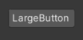
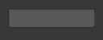
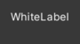
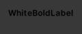
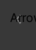
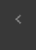
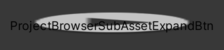

# Unity Editor Styles

A quick lookup guide on the different built-in editor GUIStyles for Unity.

This is a comprehensive list of all the GUIStyles accessible via `GUI.skin.customStyles`

[Dark](Dark/README.md) •
[Light](Light/README.md) •
[A Word of Warning](#a-word-of-warning) •
[Versions](#versions) •
[Usage](#usage) •
[FAQ](#faq) •

 

## A Word of Warning

Both lists have over **1200 images** that will be loaded. The browser will show signs of slowing down. It might take up to **15 seconds** for the list to be fully loaded.

## Versions

All screenshots were made using the Unity version `2021.3.16f1` 
Almost all of these should exist in older versions of Unity although I cannot guarantee it.

## Usage

The list is broken up into two parts. One for the [Light](Light/README.md) theme and one for the [Dark](Dark/README.md) theme of Unity.

Click on either one and the list will load. Due to Unity having over 600 built-in styles this might take up to 15 seconds.

Each list is has a large table with three columns. The name, the style with text and the style without text[^1].

### Sample

| GUIStyle name | With Text | Without Text |
| --- | --- | --- |
| <h3>LargeButton</h3> |  |  |

Once an adequate style has been found, simply copy and paste it into Unity.
`GUIStyle style = new GUIStyle("LargeButton")`

[^1]: Actually there is some text. Two tabs were added to better display styles.

## FAQ

### There are some styles missing!

Yeah probably. My goad was not to list every style there is. Just a good number of them.
  

### There is nothing in this style!

| GUIStyle name | With Text | Without Text |
| --- | --- | --- |
| <h3>WhiteLabel</h3> |  |  |

Some styles were ment only for **text** purposes. A label without text is therefor kindof empty.
  

### There is nothing in this style! (this time really!)

| GUIStyle name | With Text | Without Text |
| --- | --- | --- |
| <h3>AnimationRowEven</h3> |  |  |

These kind of styles are `obsolete`. They are most likely there to not break older scripts that use them.
  

### If they are obsolete then why include them?

Exactly because they are. If someone tries to debug their code but the label won't show up, then this could be because they are using an obsolete style.
  

### This dosen't make any sense!

| GUIStyle name | With Text | Without Text |
| --- | --- | --- |
| <h3>WhiteBoldLabel</h3> |  |  |

That's just how the style is by default. Someone forgot to set the font color to white.
  

### Why is the text cutoff?

| GUIStyle name | With Text | Without Text |
| --- | --- | --- |
| <h3>ArrowNavigationLeft</h3> |  |  |

This is because the text does not contribute to the styles `layout`. If you would use them their text will overlap other elements.
  

### There is no text at all!

| GUIStyle name | With Text | Without Text |
| --- | --- | --- |
| <h3>CN EntryInfoIcon</h3> |  |  |

Some styles do not support text. Those are usually only ment for icons. 
  

### Then what is this?

| GUIStyle name | With Text | Without Text |
| --- | --- | --- |
| <h3>ProjectBrowserSubAssetExpandBtn</h3> |  |  |

Those icons scale with the size of the element. Since there are two tabs even in the text-less version it gets streched.
  
